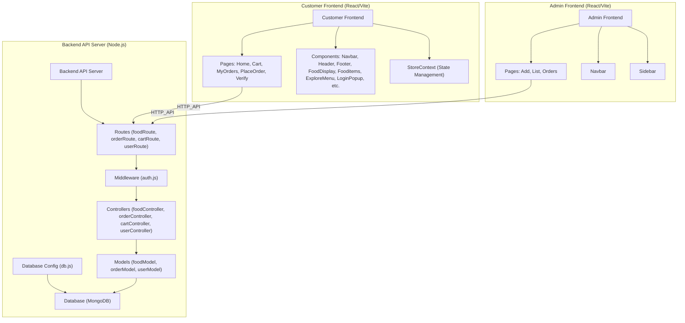

# Royal Food - Food Ordering Application

A full-stack food ordering web application built with **React (Vite)** for the Customer and Admin dashboards, and **Node.js** for the backend API server. The project uses modular architecture for scalability and easy maintenance.

## Project Structure

```bash
royal_food/
├── admin-frontend/    # Admin Dashboard (React/Vite)
├── backend/           # Backend API (Node.js)
└── frontend/          # Customer Frontend (React/Vite)
```

## Tech Stack

- **Frontend (Customer & Admin):** React.js + Vite
- **Backend:** Node.js + Express.js
- **Database:** MongoDB
- **State Management:** Context API
- **Authentication:** Custom Middleware
- **API Communication:** HTTP REST APIs

## Architecture Diagram


